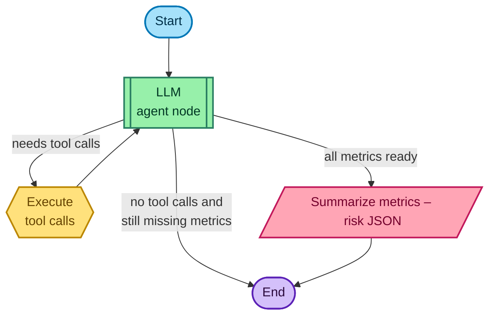

# Architecture

providers -> data_layer -> metrics

providers: simple wrapper functions around specific third-party API's endpoints
data_layer: is an abstraction layer on top of providers, doing necessary aggregation and transformations to get the data we need
metrics: the complex metrics computed from data_layer

