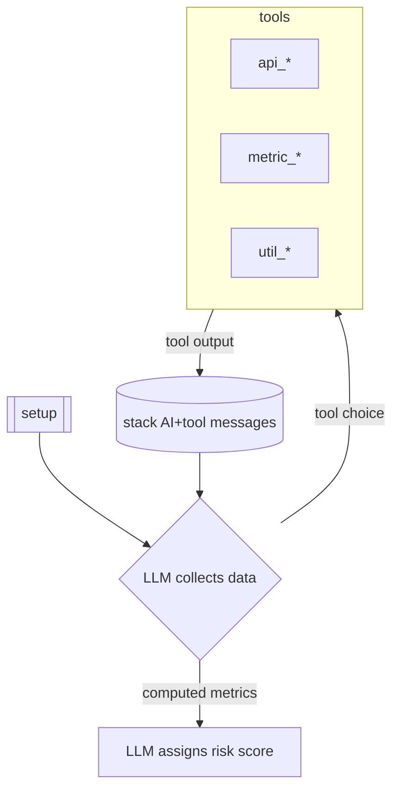

# Defi Risk Agent
This is a PoC AI agent that takes an Ethereum wallet in input and, by looking at what DeFi activity they are involved with, produces a 0-100 score representing the tolerance for risk of the investor. 

# Features
- modular architecture, easy to expand (see [Architecture](#architecture))
- structured final output, in fixed schema (thanks to [instructor](https://github.com/567-labs/instructor))
- rate limiting configurable per each individual api call
- resume from a previous run from a specific turn with `just resume threadid:turn`
- hard stop at `--max-turns` LLM invocations (default: 10)
- pass only the last `--max-messages` to each LLM invocation (default: 7)
- json logs with `--log-format json`

# Installation

requires [poetry](https://python-poetry.org/docs/):

`poetry install`

# Running
Manually for one address (with [just](https://github.com/casey/just)):

`just run 0x7a29aE65Bf25Dfb6e554BF0468a6c23ed99a8DC2`

or:

`poetry run -m src.cli 0x7a29aE65Bf25Dfb6e554BF0468a6c23ed99a8DC2`

For a batch of addresses:

`just brun`

or

`./batch_run.sh`

# Architecture

The architecture consists of a main `LLM->tools->LLM` loop. 

The LLM calls api_* tools (in [src/providers](src/providers)) to gather data, then uses this to compute metric_* tools (in [src/metrics](src/metrics)) which provide risk metrics - see [Risk Metrics](#risk-metrics). The main prompt used at each iteration can be found [here](src/prompts/system.md). Finally, all the computed metrics are passed to a final prompt, (available [here](src/prompts/risk.md)) that asks the LLM to make a subjective assessment of the risk, based on the provided metrics.

## Motivation
The core insight that drove this design is that we can think of metrics as pure functions, where we can very easily specify the required inputs and expected outputs, whereas api calls can be considered as messy JSON blobs, with each data provider choosing their own format. Sure, we could painstakingly map them out, and maintain our data types to stay up-to-date with upstream schema changes... but why not use LLMs for that? The main loop is basically doing just that, asking the LLM to figure out what data it needs to compute the metrics, then query api endpoints that sound promising, extract what it needs, until finally it can compute the metrics.

## Risk Metrics
With the help of AI I came up with an extensive list of metrics that can be used to measure risk, see [defi_risk_metrics.md](defi_risk_metrics.md) for a full list, divided by macro-area. Out of these I selected the following, which are currently implemented in [src/metrics](src/metrics/):

1. Portfolio Concentration Index (HHI): calculated on the wallet's holdings to measure diversification. A score near 1 signifies high concentration in a single asset.
2. Exotic & Unproven Asset Exposure: the percentage of a wallet's value held in assets that are outside the top 100–200 by market capitalization or have a very short history.
3. Low-TVL Protocol Concentration: the percentage of a wallet's assets that are deployed in protocols with a Total Value Locked (TVL) below a certain threshold, such as $5 million.
4. Portfolio Churn Rate: the value of assets swapped or transferred out over a period, calculated as a percentage of the wallet's average total value.
5. Bridged Asset Exposure: the percentage of the wallet's total value that is held in bridged (non-native) assets.
